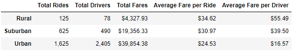
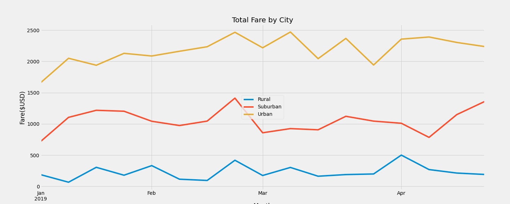

# PyBer Analysis with MatPlotLib

## Overview of Project

### Purpose
To analyze ride-share profit data by city type

## Results
- The urban market is the highest grossing market because it has the most activity, followed by Suburban, and then Rural markets. The more activity in the market, the lower the average fare price is because if you are using ride sharing more often, you are using for shorter rides and longer rides.
- Because there is more activity in the Urban market, there are more drivers. Therefore the average fare per driver decreases with the higher rideshare activity even though the total fare amount is the highest.
- For Rural markets, where there are less drivers, the average fare per driver is higher. Right now I can only assume that this is based on the lower availability and demand than the busier markets.

- As demonstrated in the chart below, the overall trends over time show increased and decreased weekly fares around the same time. You can now visually see the the Urban market earns nearly 4 times as much in fares than the Rural market and about 2 times the Suburban market.

## Summary
My 3 recommendations are as follows:

1) Gather data for the length of time drivers have riders in their vehicles as well as the distance of the rides. This will give a better picture of if the market has enough drivers available or if there is a shortage. In case there is another reason for the higher average fare in Rural areas than in Urban areas.
2) The additional data suggested in my first suggestion will also help determine if prices could change. For example are riders taking "short" rides more often in larger markets? Will want to determine if drivers are making enough money to want to continue driving for PyBer.
3) It would also help to examine data month by month over a few years to see if there are certain seasons or occasions for surge pricing opportunities, or to offer reduced pricing to encourage more rides. It will also see if the total fares and rides have increased or decreased over time to determine where there are opportunities for improvement.
